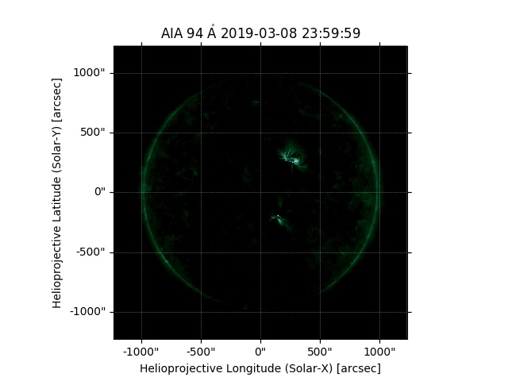
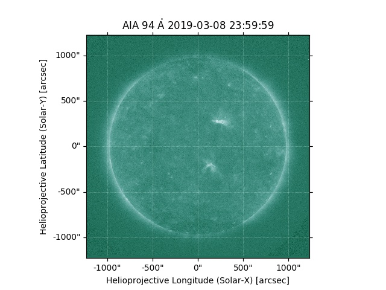
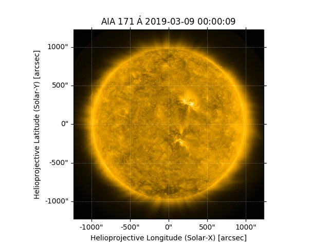
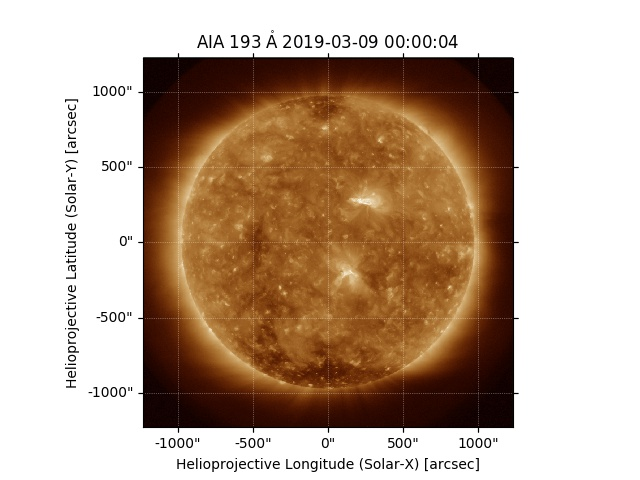
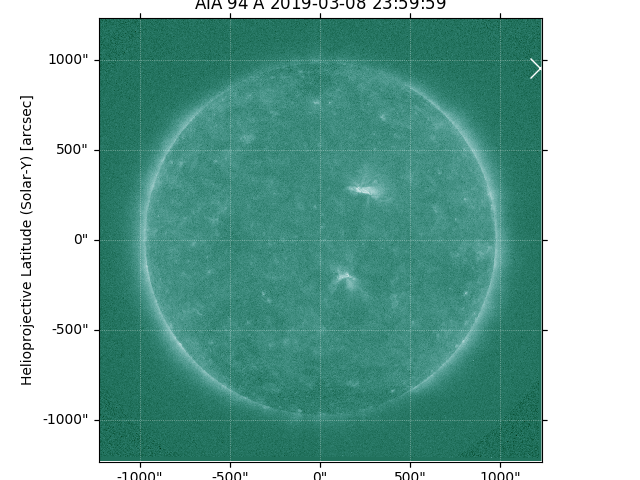
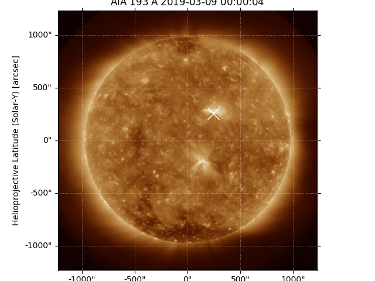

# High Temperature Solar EUV Signal Extraction and Restorion

## Preprocess the data to get Fe_XVIII signal
The method is from [A Systematic Survey of High-Temperature Emission in Solar Active Regions](http://dx.doi.org/10.1088/0004-637X/759/2/141) to extract Fe_XVIII signal on 94 by subtracting "warm" signal from 171 and 193.
The data is from [Standford JSOC Database](http://jsoc.stanford.edu/data/aia/synoptic/)

### Week 1
The result of a Fe_XVIII signal full disk [solar picture](pics/20190309_Fe_XVIII.jpg) is obtained from [94 image](pics/20190309_0000_0094.jpg), [171 image](pics/20190309_0000_0171.jpg), [193_image](pics/20190309_0000_0193.jpg).

### Week 2
After some preprocessing, I did the first GAN on data on first 3 months of data and I found that the loss function never
converge because it will pick noise around the sun like [this](pics/plot_000900.png). 

Indeed, after I found the maximum points on both 94 and 193. I found that the maximum point of 94 is actually out side of
the sun. While the 193 looks good. Here are the pictures.

